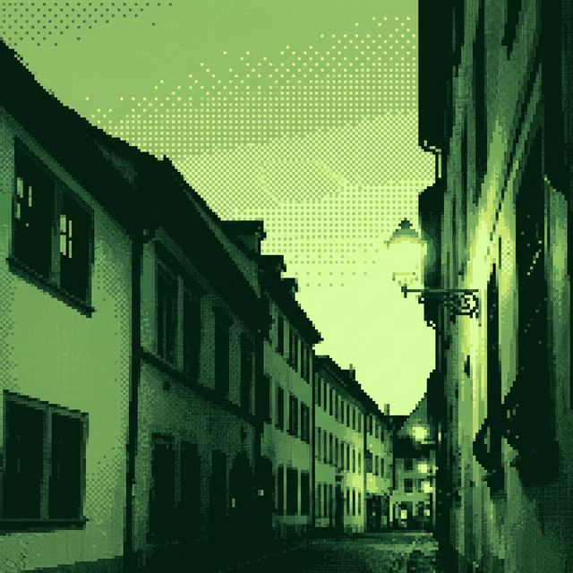

<div align="center">



# ca\_mera

**Game Boy Camera emulator for the web**

Capture viby retro photos with authentic 4-shade dithering, edge enhancement, and swappable color palettes — straight from your browser.

[](https://marktremmel.github.io/ca-mera/)
[](LICENSE)

</div>

---

## ✨ Features

| | |
|---|---|
| 📷 **Live Camera Preview** | Real-time GB Camera processing at full frame rate |
| 🎨 **6 Color Palettes** | Classic GB · Sunset · Amber · Teal · Noir · Vaporwave |
| ⚙️ **Adjustable Controls** | Contrast & edge enhancement sliders |
| 📱 **Import Photos** | Apply the filter to any image from your device |
| 🖼️ **Gallery** | Save up to 30 photos (just like the original!) |
| 💾 **Download & Share** | Export as PNG, or share via the native share sheet |
| 📲 **PWA Installable** | Add to Home Screen on iPhone/Android |
| 🔌 **Zero Dependencies** | Pure vanilla JS + Canvas API, no frameworks |

---

## 📸 How It Works

The image processing pipeline emulates the **Mitsubishi M64282FP** "Artificial Retina" sensor:

```
Camera → Downscale 128×112 → Grayscale → Contrast → Edge Enhance → 4×4 Bayer Dither → Palette
```

<div align="center">

| Step | What it does |
|:---:|---|
| **Downscale** | Shrinks to Game Boy Camera's native 128×112 resolution |
| **Grayscale** | Luminance-weighted conversion (BT.601) |
| **Contrast** | Adjustable contrast curve (0.5–2.5×) |
| **Edge Enhance** | 3×3 Laplacian convolution, emulating the sensor's 2D filter mode |
| **Ordered Dither** | 4×4 Bayer matrix — the signature dot pattern |
| **Palette** | Map 4 quantized shades to your chosen color palette |

</div>

---

## 🎨 Palettes

<div align="center">

| Classic GB | Sunset | Amber | Teal | Noir | Vaporwave |
|:---:|:---:|:---:|:---:|:---:|:---:|
| ⬛🟩🟩🟩 | ⬛🟥🟧🟨 | ⬛🟫🟡⬜ | ⬛🟢🟢🟩 | ⬛⬜⬜⬜ | 🟪🟪🟥🟧 |
| `#0f380f` | `#1a1034` | `#1b1000` | `#0d1b0e` | `#000000` | `#2b0040` |
| `#306230` | `#8b3a62` | `#6b4e00` | `#1a5c2a` | `#555555` | `#8000a0` |
| `#8bac0f` | `#e05a46` | `#c8a800` | `#3cb460` | `#aaaaaa` | `#ff6090` |
| `#9bbc0f` | `#f2d09e` | `#ffffff` | `#9fffb0` | `#ffffff` | `#ffcc80` |

</div>

---

## 🚀 Quick Start

```bash
# Clone
git clone https://github.com/marktremmel/ca-mera.git
cd ca-mera

# Install & run
npm install
npm run dev
# → Opens at http://localhost:5173/
```

Or just visit the **[live demo →](https://marktremmel.github.io/ca-mera/)**

---

## 📱 Install as App

On **iPhone/iPad**: Open in Safari → Share → "Add to Home Screen"

On **Android**: Open in Chrome → tap the install banner

The app works fully offline once installed.

---

## 🏗 Project Structure

```
ca_mera/
├── index.html              # SPA shell
├── index.css               # Dark retro theme
├── vite.config.js          # Vite config
├── manifest.json           # PWA manifest
├── src/
│   ├── main.js             # App wiring & event handling
│   ├── gbcProcessor.js     # Image processing pipeline
│   ├── palettes.js         # 6 color palettes
│   ├── camera.js           # Camera access & management
│   └── gallery.js          # localStorage photo gallery
└── docs/
    └── *.png               # README assets
```

---

## 🛣 Roadmap

- [ ] Stamps & stickers overlay (like the original Game Boy Camera!)
- [ ] Delay timer & time-lapse mode
- [ ] Mirror / flip trick lenses
- [ ] Photo frames & borders
- [ ] Animation mode (combine photos into GIF)
- [ ] Native iOS app (Swift + Metal shaders)

---

## 🧠 Technical Notes

- **128×112** native resolution — the exact output of the original Game Boy Camera
- **4×4 Bayer ordered dithering** with 0.33 spread factor for authentic dot patterns
- **Edge enhancement** uses a 3×3 Laplacian sharpening kernel, similar to the M64282FP's built-in 2D filter
- **Nearest-neighbor upscaling** for the chunky pixel look (no interpolation/anti-aliasing)
- **Max 30 photos** in gallery — same limit as the original cartridge!
- All processing runs on `OffscreenCanvas` for performance

---

## 📄 License

MIT © [Mark Tremmel](https://github.com/marktremmel)

---

<div align="center">
<sub>Inspired by the <b>Nintendo Game Boy Camera</b> (1998) and its Mitsubishi M64282FP "Artificial Retina" sensor.</sub>
</div>
